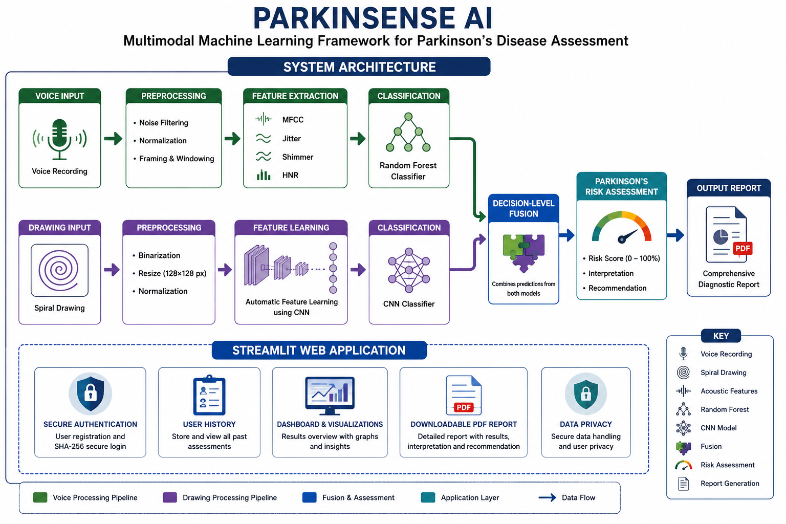
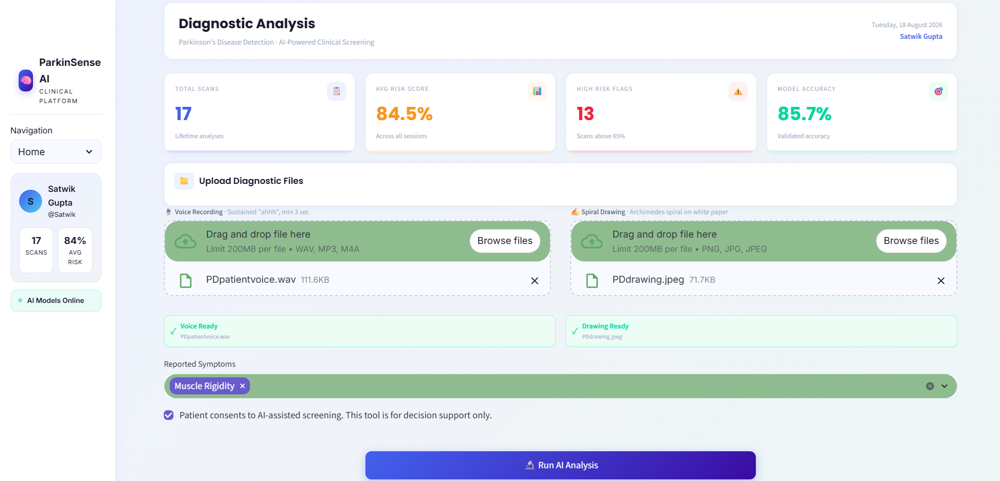
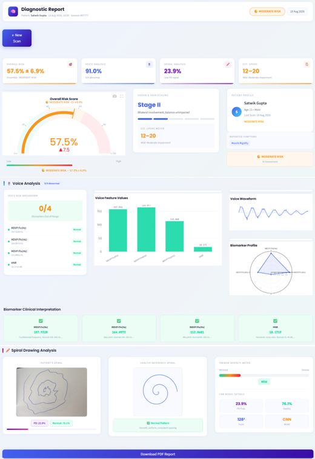

<div align="center">

# 🧠 ParkinSense AI

### A Multimodal Machine Learning Framework for Early Prediction of Parkinson’s Disease Using Voice and Hand-Drawn Patterns

<p>
  
  
  
  
  
</p>

<p>
  <b>Voice Analysis</b> &nbsp;•&nbsp;
  <b>Spiral Drawing Analysis</b> &nbsp;•&nbsp;
  <b>Random Forest</b> &nbsp;•&nbsp;
  <b>CNN</b> &nbsp;•&nbsp;
  <b>Decision-Level Fusion</b>
</p>

</div>

---

## 📌 Overview

**ParkinSense AI** is a multimodal machine learning framework developed to support **early screening of Parkinson’s disease** using two complementary, non-invasive modalities:

- 🎙️ **Voice analysis** — acoustic biomarkers are extracted from voice recordings and classified using a Random Forest model.
- ✍️ **Hand-drawn spiral analysis** — spiral drawings are preprocessed and analyzed using a Convolutional Neural Network (CNN).
- 🔗 **Decision-level fusion** — prediction probabilities from both models are combined to produce a final multimodal risk estimate.

The system goes beyond offline model experimentation by providing an interactive **Streamlit web application** with user authentication, assessment history, result visualization, and downloadable reports.

> ⚠️ **Important:** This project is intended for academic research and early-screening exploration. It is **not a substitute for professional neurological evaluation or clinical diagnosis**.

---

## 🏗️ System Architecture

<p align="center">
  
</p>

<p align="center">
  <em>End-to-end architecture of the multimodal Parkinson's disease assessment framework.</em>
</p>

### 🎙️ Voice Processing Pipeline

**Voice Recording → Preprocessing → Feature Extraction → Random Forest → Voice Prediction**

The voice pipeline extracts acoustic characteristics including:

- MFCCs
- Jitter
- Shimmer
- Harmonics-to-Noise Ratio (HNR)
- Pitch-related measurements

### ✍️ Drawing Processing Pipeline

**Spiral Drawing → Preprocessing → CNN Feature Learning → CNN Classifier → Shape Prediction**

Spiral images are:

1. Binarized
2. Resized to **128 × 128 pixels**
3. Normalized
4. Passed through a CNN for automatic feature learning

### 🔗 Decision-Level Fusion

The probability outputs of the two models are combined using a weighted fusion strategy:

```text
P_final = α × P_voice + (1 − α) × P_shape
```

with:

```text
α = 0.75
1 − α = 0.25
```

---

## 📊 Model Performance

<div align="center">

| Model | Modality | Accuracy |
|:---|:---:|---:|
| 🌲 **Random Forest** | Voice | **94.87%** |
| 🧠 **CNN** | Hand-drawn Spiral | **76.66%** |
| 🔗 **Weighted Fusion** | Voice + Spiral | **85.70%** |

</div>

### 🎙️ Voice Model — Random Forest

The voice-based model uses acoustic features associated with Parkinsonian dysphonia, including jitter, shimmer, HNR, pitch-related measurements, and MFCC-based information.

**Test accuracy: 94.87%**

### ✍️ Spiral Model — CNN

The image-based model uses a three-layer convolutional neural network to learn tremor-related distortions and irregularities directly from preprocessed spiral drawings.

**Test accuracy: 76.66%**

### 🔗 Multimodal Model — Weighted Fusion

The two prediction probabilities are combined through decision-level fusion.

**Fused accuracy: 85.7%**

The multimodal approach combines two different symptom dimensions — vocal characteristics and motor-pattern information — into a single assessment.

---

## 🖥️ Web Application

The trained models are integrated into an interactive Streamlit application.

| Feature | Description |
|:---|:---|
| 🎙️ Voice Recording | Accepts voice input for acoustic analysis |
| ✍️ Spiral Drawing | Accepts hand-drawn spiral input |
| 📊 Dashboard | Displays analysis results and visualizations |
| 🧬 Biomarker Analysis | Presents selected voice-related measurements |
| 🌀 Spiral Analysis | Provides CNN-based drawing analysis |
| 🔗 Risk Assessment | Combines the two modalities |
| 📜 User History | Stores and displays previous assessments |
| 📄 PDF Reports | Generates downloadable reports |
| 🔐 Authentication | Provides user registration and login |

---

## 📸 Application Preview

If you have application screenshots, place them in `assets/` and use the following sections.

### Diagnostic Dashboard

<p align="center">
  
</p>

### Analysis Report

<p align="center">
  
</p>

---

## 🧠 CNN Architecture

```text
Input: 128 × 128 Spiral Image
              │
              ▼
      Conv2D — 32 filters
              │
        Max Pooling
              │
              ▼
      Conv2D — 64 filters
              │
        Max Pooling
              │
              ▼
      Conv2D — 128 filters
              │
        Max Pooling
              │
              ▼
           Flatten
              │
              ▼
        Dense — 256
              │
        Dropout — 0.5
              │
              ▼
       Dense — 1 Sigmoid
              │
              ▼
       Binary Prediction
```

---

## 🔬 Methodology

### 1. Data Collection

Two publicly available research datasets were used:

- **UCI Parkinson's Speech Dataset** for voice analysis.
- **HandPD Dataset** for hand-drawn spiral analysis.

### 2. Preprocessing

**Voice:** normalization and signal preprocessing before acoustic feature extraction.

**Spiral images:** binarization, resizing to 128 × 128 pixels, and spatial normalization.

### 3. Feature Extraction

Voice analysis uses:

- Jitter
- Shimmer
- HNR
- Pitch-related measurements
- MFCCs

For spiral analysis, the CNN automatically learns spatial features from preprocessed images.

### 4. Classification

```text
Voice Features → Random Forest → Voice Probability

Spiral Image → CNN → Shape Probability
```

### 5. Fusion

```text
P_final = 0.75 × P_voice + 0.25 × P_shape
```

---

## 📁 Repository Structure

```text
Multimodal-Parkinsons-Disease-Prediction/
│
├── assets/
│   └── system-architecture.png
│
├── .streamlit/
│   └── config.toml
│
├── parkinsons_cnn_ensemble/
│   ├── config.json
│   ├── metadata.json
│   └── model.weights.h5
│
├── newtry.py
├── parkinson_cnn_model.h5
├── parkinson_model.pkl
├── parkinsons_voice_model.pkl
├── label_encoder.pkl
├── voice_scaler.pkl
├── parkinsons.data
├── users.db
├── requirements.txt
├── .gitignore
└── README.md
```

---

## 🛠️ Technology Stack

| Area | Technology |
|:---|:---|
| Programming Language | **Python** |
| Machine Learning | **Scikit-learn** |
| Deep Learning | **TensorFlow / Keras** |
| Voice Analysis | **Acoustic Features + MFCCs** |
| Image Analysis | **Convolutional Neural Network** |
| Web Application | **Streamlit** |
| Database | **SQLite** |
| Model Serialization | **Pickle / HDF5** |
| Configuration | **JSON / TOML** |

---

## 🚀 Installation & Setup

### Prerequisites

- Python 3.x
- pip
- Git

### 1. Clone the Repository

```bash
git clone https://github.com/AnuSar18/Multimodal-Parkinsons-Disease-Prediction.git
cd Multimodal-Parkinsons-Disease-Prediction
```

### 2. Create a Virtual Environment

#### Windows

```bash
python -m venv venv
venv\Scripts\activate
```

#### macOS / Linux

```bash
python3 -m venv venv
source venv/bin/activate
```

### 3. Install Dependencies

```bash
pip install -r requirements.txt
```

### 4. Run the Application

```bash
streamlit run newtry.py
```

---

## 📚 Datasets

### UCI Parkinson's Speech Dataset

The voice component is based on the Parkinson's Speech Dataset from the **UCI Machine Learning Repository**.

The dataset contains voice measurements from 31 subjects and 195 voice recordings, including Parkinson's disease and healthy-control samples.

### HandPD Dataset

The spiral-analysis component uses the **HandPD dataset**, containing hand-drawn spiral samples from Parkinson's disease patients and healthy individuals.

Please refer to the original dataset providers for licensing, attribution, and permitted usage.

---

## 📄 Publication

### *A Multimodal Machine Learning Framework for Early Prediction of Parkinson’s Disease Using Voice and Hand-Drawn Patterns*

**Authors**

- Rupali Deshmukh
- Anushka Sarkar
- Mereena Varghese
- Sukhada Wadodkar
- Shantanu Shinde

**Department of Information Technology**  
Fr. C. Rodrigues Institute of Technology, Vashi, India

---

## 🔐 Security & Privacy

The application includes user authentication and password hashing as implemented in the research prototype.

Do not commit:

- API keys
- Passwords
- Authentication secrets
- Private credentials
- Sensitive patient information

The `.gitignore` excludes environment-specific and generated files such as:

```text
venv/
__pycache__/
.vscode/
*.pyc
```

> **Important:** Because `users.db` is currently part of the repository, verify that it contains no real personal or sensitive user information before sharing or deploying the project publicly.

---

## ⚠️ Medical Disclaimer

This project is an **academic research implementation and early-screening aid**.

It is not presented as a clinically validated diagnostic system. Predictions should **not** be interpreted as a medical diagnosis and should not replace evaluation by a qualified healthcare professional.

Clinical deployment would require additional validation, larger and more diverse datasets, appropriate clinical studies, and applicable regulatory review.

---

<div align="center">

## ⭐ ParkinSense AI

### Voice • Motor Patterns • Multimodal Machine Learning

*Academic research project on multimodal machine learning for Parkinson's disease screening.*

</div>
